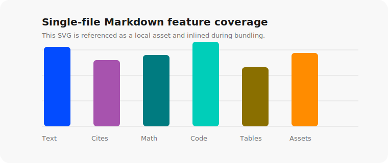

# Vibepage Markdown Feature Reference

This fixture is a compact reference for the simple static document route. It intentionally uses the Markdown features that `markdown-to-html.ts` supports: headings, paragraphs, emphasis, links, blockquotes, lists, task lists, tables, code highlighting, KaTeX math, local image assets, image source captions, HTML details blocks, and numeric footnotes.[^renderer]

Use this file when an agent is unsure about syntax. The rendered page should stay a plain document: no custom header, footer, table of contents, or app shell unless the user explicitly asks for those pieces in the Markdown itself.

## Text, Links, And Callouts

Markdown emphasis works as expected: **strong claim**, *careful qualification*, `inline code`, and [external links](https://opencode.ai) are rendered inline. External links open in a new tab in this renderer.[^links]

> Use blockquotes for short caveats, quoted material, or a one-paragraph executive note. Keep the quote content meaningful; avoid generic filler.

## Lists And Tasks

Ordered lists work well for procedures:

1. Write the Markdown source.
2. Cite non-obvious factual claims with footnotes.
3. Render with `markdown-to-html.ts`.
4. Preview the generated page before sharing.

Unordered lists work well for compact observations:

- The default theme is `opencode`.
- The optional `--theme github` flag produces a GitHub-style document.
- Both themes include light and dark variants through `prefers-color-scheme`.

Task lists are supported by Marked's GFM mode:

- [x] Render headings and paragraphs
- [x] Render footnotes as numeric citations
- [x] Inline local image assets into the standalone HTML
- [ ] Add JavaScript interactions only when the dynamic route is needed

## Tables

Tables should be concise and data-dense. Prefer a short explanation before or after the table instead of turning the table into a layout grid.

| Feature | Syntax | Rendered Behavior |
| --- | --- | --- |
| Footnote | `Claim.[^source]` | Numeric superscript plus bottom reference section |
| Inline math | `$E = mc^2$` | Server-rendered KaTeX span |
| Display math | `$$...$$` | Centered KaTeX block with horizontal overflow protection |
| Code fence | <code>```ts</code> | Shiki-highlighted block |
| Image caption | `` followed by italic text | Image plus plain Markdown caption |

## Math

Inline math is useful inside sentences: the logistic transform is $\sigma(x)=\frac{1}{1+e^{-x}}$.

Display math is better for equations that deserve their own line:

$$
\operatorname{softmax}(z_i)=\frac{e^{z_i}}{\sum_{j=1}^{K}e^{z_j}}
$$

When writing academic or technical pages, cite the conceptual or empirical source with a footnote instead of pasting a raw URL into the paragraph.[^math]

## Code Blocks

Use fenced code blocks with a language tag so Shiki can pick the right grammar.

```ts
type Theme = "opencode" | "github"

function renderCommand(markdownPath: string, theme: Theme = "opencode") {
  const flag = theme === "github" ? " --theme github" : ""
  return `bun run markdown-to-html.ts${flag} < ${markdownPath} > report.html`
}
```

Plain text fences are also acceptable for terminal output or logs:

```text
Usage: bun run markdown-to-html.ts [--title <title>] [--theme opencode|github] < input.md > output.html
```

## Images And Captions

Use normal Markdown image syntax for local assets. Relative paths are resolved from the current working directory, so render this example from the `skills/vibepage/examples` directory or provide an absolute path.


*Source: Synthetic fixture chart for vibepage renderer testing. For real reports, keep image captions short and put detailed source metadata in a footnote when needed.[^image-source]*

## Collapsible Details

Raw HTML is available when the Markdown needs a small semantic element that standard Markdown lacks. Use it sparingly.

<details>
<summary>Show rendering command examples</summary>

```bash
cat markdown-features.md | bun run ../markdown-to-html.ts > /var/www/vibe/vibepage-markdown-features-opencode-v1.html
cat markdown-features.md | bun run ../markdown-to-html.ts --theme github > /var/www/vibe/vibepage-markdown-features-github-v1.html
```

</details>

## Footnotes

Footnotes use common `[^label]` syntax. Labels can be descriptive for the author, but rendered markers are numeric. Reusing the same label points to the same numbered footnote, as in this repeated citation.[^renderer]

Put definitions near the end of the Markdown source. The renderer moves them into a footnotes section automatically.

[^renderer]: The simple static route uses Marked with `marked-footnote`, `marked-katex-extension`, and Shiki, then bundles the result into a standalone HTML file.
[^links]: External links are rendered with `target="_blank"` and `rel="noopener noreferrer"` by the script's custom link renderer.
[^math]: KaTeX is rendered server-side. The output embeds KaTeX CSS and WOFF2 fonts so equations remain readable without external network requests.
[^image-source]: Image source captions should be short. If a source needs a full citation, licensing note, or data-processing explanation, put that detail in a footnote.
